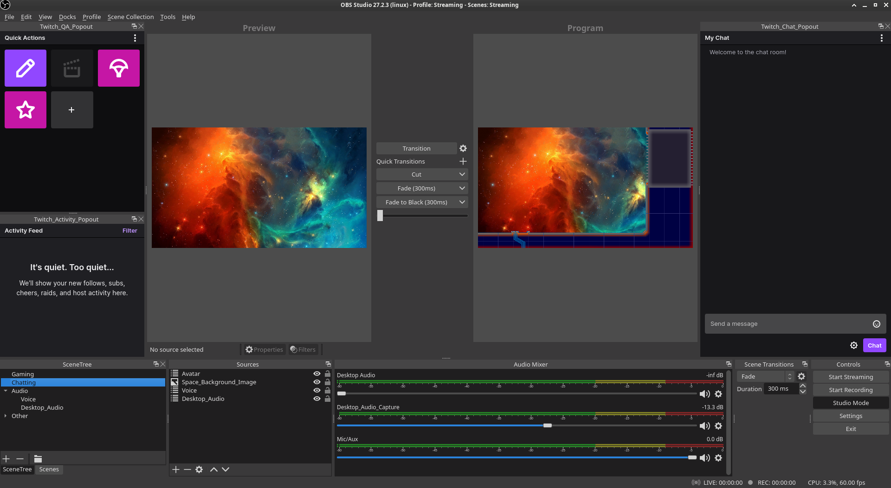

# Scene Tree Folder plugin for OBS Studio

Plugin for OBS that adds a scene tree folder dock



## Build

### Linux

- Ensure that `obs-studio` and `qt5-base` are installed
  - Arch Linux: `sudo pacman -S obs-studio qt5-base`
- Download repository
- Execute inside the repository directory: 
  ```bash
  mkdir build
  cd build
  cmake ..
  make
  sudo make install
  ```

### Windows

- Setup OBS Studio build environment (see https://obsproject.com/wiki/Install-Instructions)
- Download this repository into `UI/frontend-plugins/obs_scene_tree_view`
- Add the following to `UI/frontend-plugins/CMakeLists.txt`:
  ```cmake
  set(BUILD_IN_OBS ON)
  add_subdirectory(obs_scene_tree_view)
  ```
- Build and install OBS Studio


## Installation

### Linux

#### Arch Linux

Available via the `obs-scene-tree-view-git` AUR package:

```bash
pikaur -S obs-scene-tree-view-git
```

### Windows

Visit [Releases](https://github.com/DigitOtter/obs_scene_tree_view/releases) and follow the installation instructions for the newest version.

## Todos

- [ ] Undo/Redo scene rename does not update SceneTree
- [ ] Add Fullscreen Viewport Projector option to scene context menu

